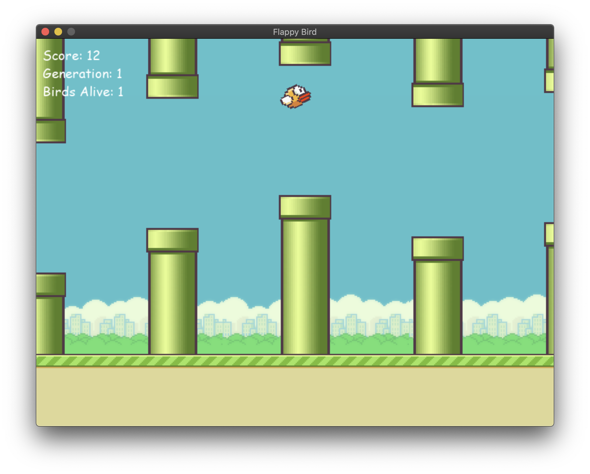

# Flappy Bird with NEAT AI


## Description

This is a simple implementation of the Flappy Bird game using the NEAT (NeuroEvolution of Augmenting Topologies) algorithm to train an AI to play the game.
the game is implemented using the Pygame library and the NEAT algorithm is implemented using the neat-python library.

## Installation

clone the repository using the following command.

```bash
git clone https://github.com/abouabra/NEAT-AI-Flappy-Bird.git
```

change the directory to the cloned repository.
```bash
cd NEAT-AI-Flappy-Bird
```

Use the package manager [pip](https://pip.pypa.io/en/stable/) to install the required libraries.
```bash
pip install -r requirements.txt
```

## Usage

To run the game, simply run the main.py file.
```bash
python Game.py
```

## Contributing
Pull requests are welcome. For major changes, please open an issue first to discuss what you would like to change.
